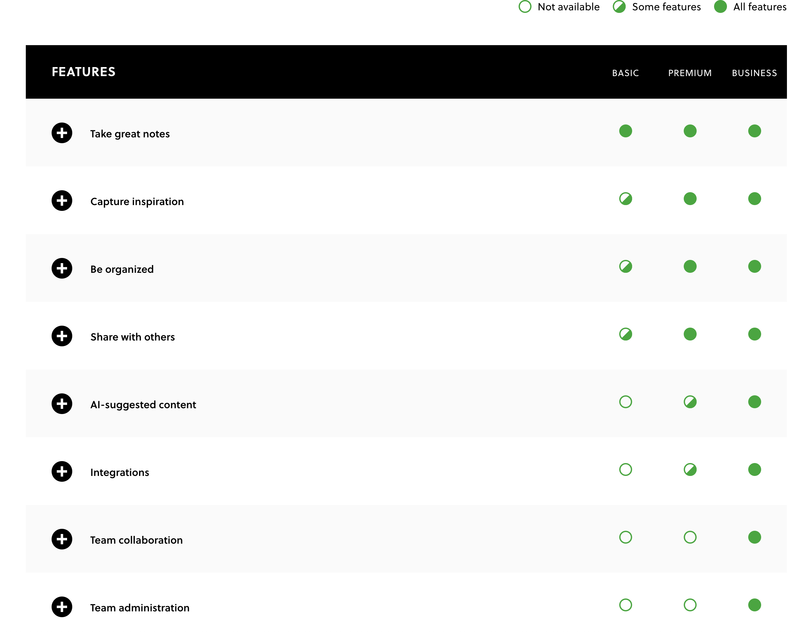
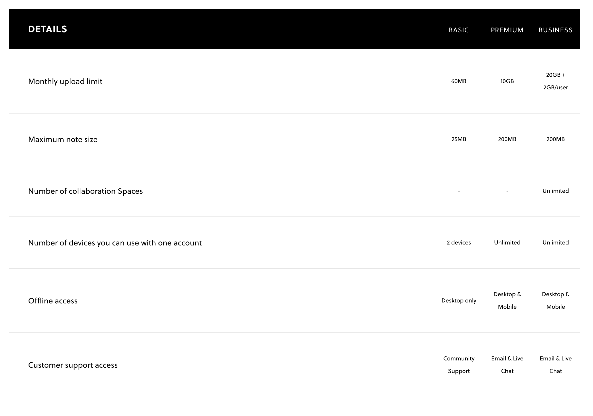
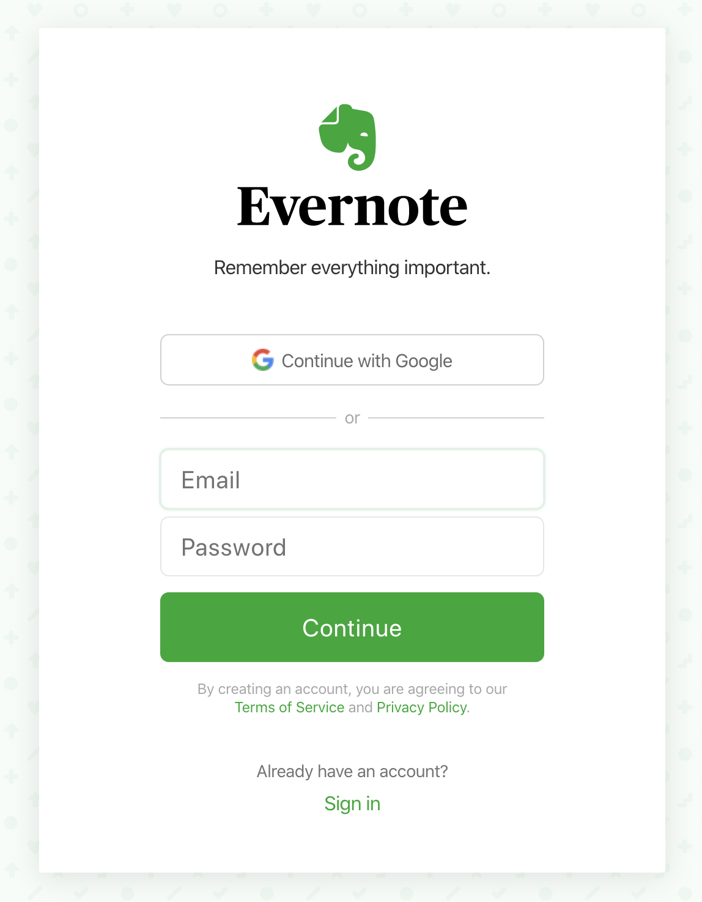

---
Path: '/login'
title: How to Efficiently Take Notes With EverNote
layout: nil
---

# Task One - Sign Up With Evernote
​
The first step to taking notes with Evernote on web browsers, is creating an account. You will need a valid email or Google account, and click **sign up for free** or **Sign Up** on the top, right corner of Evernote official website, then we will show you the process of signing up within a few steps.
​
1. Choose a plan
​
   Currently, users have three plans, Basic, Premium and Business, with different functions to choose before they sign up. The information of each plan such as features and pricing are displayed below, you will select a plan that fits your needs.
  

​
   Prices of three plans:
​
   - **Basic**: free
​
   - **Premium**: $9.99/month
​
   - **Business**: $14.99/user/month with minimum two users
​
   After making the decision of plans based on your preferences, you will click **sign up for free** or **sign up** in the square of your ideal plan, to start creating an account.
​
2. Create an account
​
   When the website jumps to a new page as the picture shown below, you will have two options for signing up.
​
   On the top, is **Continue with Google**. It allows you to start right away with your current Google account. If your Google account is logged in on the current web browser such as Chrome, simply click the button, you will be successfully logged in.
​
   The second option lets you sign up with your email. After typing your valid email address and password in, the website will redirect you to the main page of Evernote with your account logged in. Furthermore, in your email inbox, you will receive an email from Evernote about its information.

