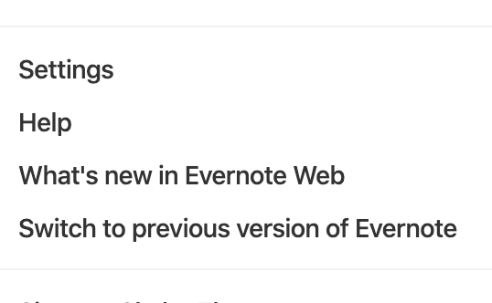

# Task One

Some content here.

## Side Bar Elements

Once you have logged in, you will jump to the home page of Evernote. The side bar on the left has ten elements. We will introduce you the features of each element from top to bottom.

- Account Managing

  The element on the top, with the icon that contains the capitalized first letter of your first name and your full username is the account managing button. After clicking the arrow at right of your username, you will see a menu with options like this.
  

- Search

  The second element with a question mark at left has a searching function.
  You can simply type in any keyword you remember from a previous note, it will search from all the existing notes, find the matching notes that contain your keyword and return them to you.

- Add Note

  The green button with "New Note" is for adding a new note, it is horizontally separated into two parts. 
  The picture shown below is the right part with a arrow pointing down contains a menu of multiple advanced note template.

  

  If you only want to add a simple, blank note, click the side with a plus sign on the left, you will see a new blank note displays on the right side of the side bar.

- Shortcuts
  
  The Shortcuts element has a customize function for you to add your own shortcuts of notes and notebooks based on references.

- All Notes

  Click the "All Notes" button to see all the notes you have created before.

- Notebooks
  
  This button allows you to see all of the existing notebooks and manage them at the right side of the side. 
